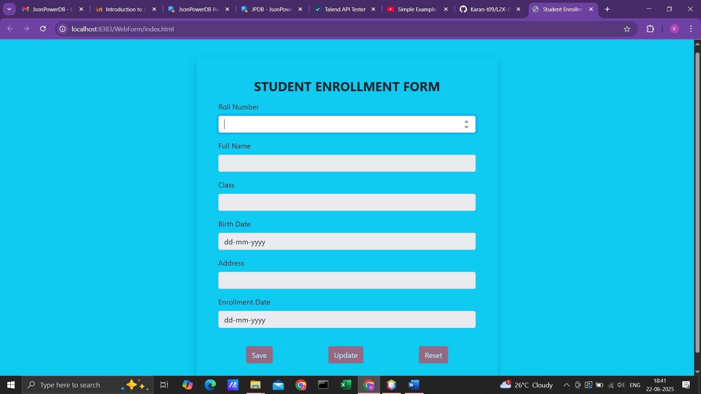
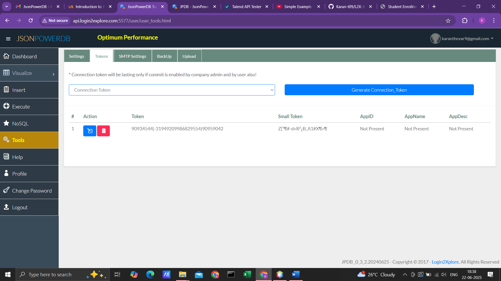
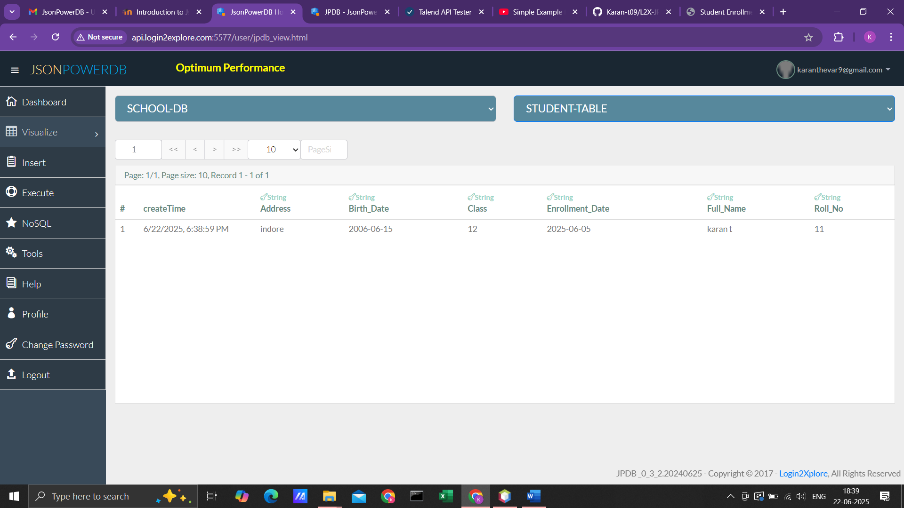
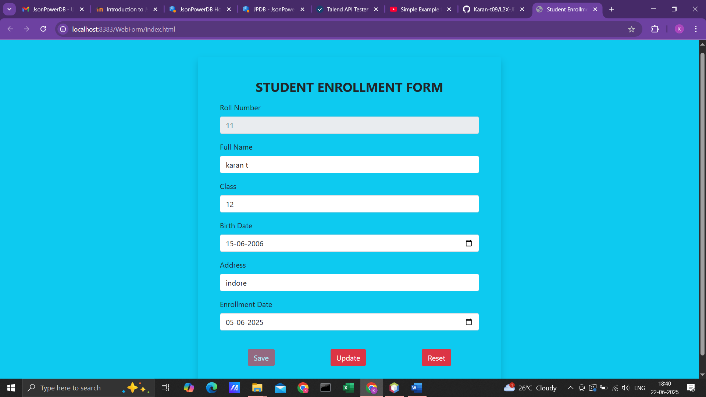
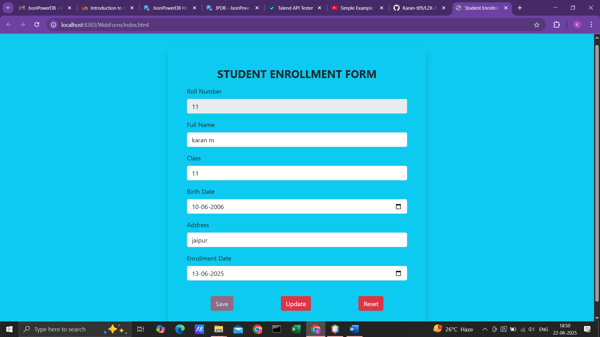
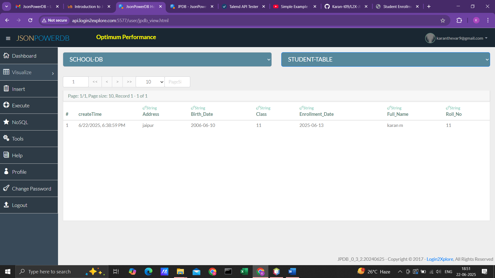

Student Enrollment Form

This is a simple web-based form for enrolling students using HTML, CSS, Bootstrap, and JavaScript. It uses the Login2Xplore JPDB JSON database for backend operations.

🔧 Features
- Save new student data
- Update existing data
- Reset form inputs
- Auto-fetch based on roll number

This is how the enrollment form looks on the web browser.

 
When we enter the first record then Database(SCHOOL-DB) and relation(STUDENT-TABLE) will be created automatically. This is the feature of JSONPowerDB. 
As per the requirements when Roll number is entered in form then ‘save’ and ‘reset’ will be active.

This is the connection token received from JSONPowerDB.

We can see the record has been created with appropriate columns.
 

When in the form roll number is entered then search will be performed in the database for the roll number and all the data will be fetched. Hence the Roll number field working as Primary Key. 
 

We can also update the record. Here I have changed the data. 

We can verify that the record has been updated in the database.

Thank you.

Features of JSONPowerDB:
•	Multi-mode Database:
JPDB supports document, key-value, and relational data models within a single platform. 
•	Schema-free:
No rigid schema is required, allowing for flexible data structures and easier development and maintenance. 
•	Serverless:
Provides a serverless architecture, enabling faster development and deployment, potentially reducing time to market. 
•	High Performance:
Built around the PowerIndex engine, known for its speed and ability to handle large datasets and numerous indexes. 
•	REST API:
Offers a RESTful API for seamless integration with various programming languages and technologies. 
•	In-memory and Real-time:
Offers in-memory processing for fast data access and real-time data manipulation. 
•	Multiple Security Layers:
Includes built-in security features to protect data. 
•	Querying Multiple Databases:
Allows querying across multiple JPDB instances or databases within a single operation. 
•	ACID Transactions:
Supports ACID (Atomicity, Consistency, Isolation, Durability) transactions for reliable data management. 

